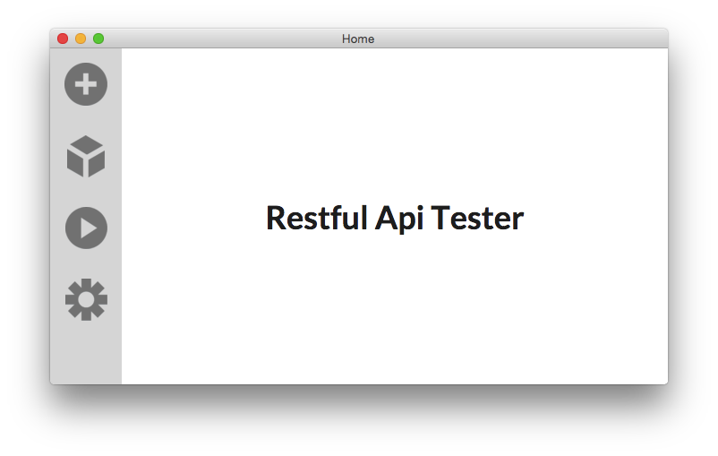

Restful Api Tester
==================

This is a [electron](http://electron.atom.io) application, just for manage HTTP request tests.

The config file path is `.config.json`. Read the example config file `misc/config.example.json` for more detail.

## Usage

```
npm install electron-prebuilt -g

cd RestfulApiTester
cp misc/config.example.json .config.json
electron ./
```

## Screen



